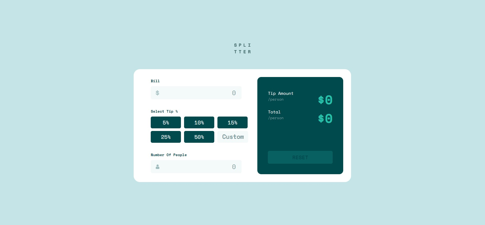

# 01 Frontend Mentor -  Tip calculator app solution

This is a solution to the [Tip calculator app challenge on Frontend Mentor](https://www.frontendmentor.io/challenges/tip-calculator-app-ugJNGbJUX).

## Table of contents

- [Overview](#overview)
  - [The challenge](#the-challenge)
  - [Screenshot](#screenshot)
  - [Links](#links)
- [My process](#my-process)
  - [Built with](#built-with)
  - [What I learned](#what-i-learned)
- [Author](#author)
### The challenge

Users should be able to:

- View the optimal layout for the app depending on their device's screen size
- See hover states for all interactive elements on the page
- Calculate the correct tip and total cost of the bill per person

### Screenshot

### Links

- [Solution URL](https://www.frontendmentor.io/solutions/tip-calculator-solution-with-vuejs-RiTPuYFE5)
-  [Live Site URL](https://tip-calculator-hmcmj78gh-rafaeldellaquila.vercel.app/)

## My process
I started using and configuring [Vue.js](https://v3.vuejs.org/). Then I made the dynamic part of the component so that in the end I could apply the stylizations and interactions.

### Built with
- [SASS](https://sass-lang.com/)  - SASS
- [Vue.js](https://v3.vuejs.org/) - JS library
### What I learned
I Use this lesson to learn more from Vue.js.

## Author

- Website - [Rafael Dell'Aquila](http://dellaquila.dev/)
- Frontend Mentor - [@rafaeldellaquila](https://www.frontendmentor.io/profile/rafaeldellaquila)
- Twitter - [@rfldllql](https://twitter.com/rfldllql)